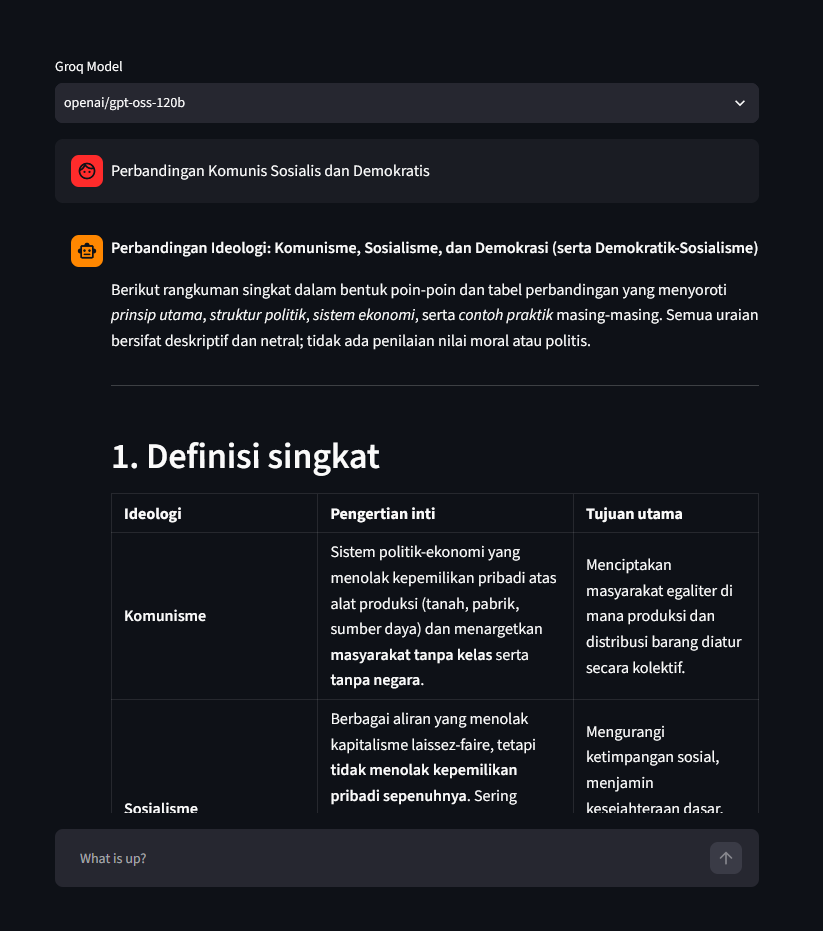
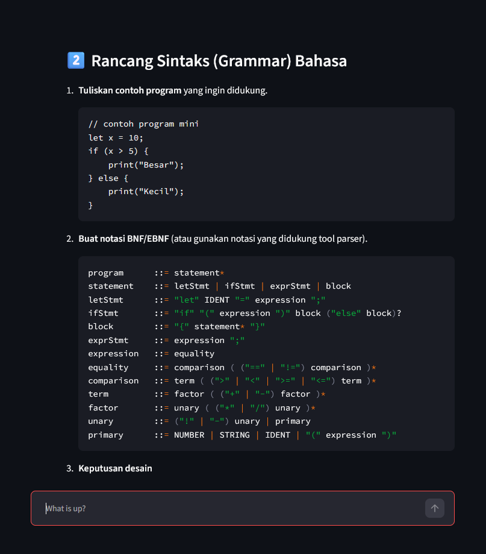
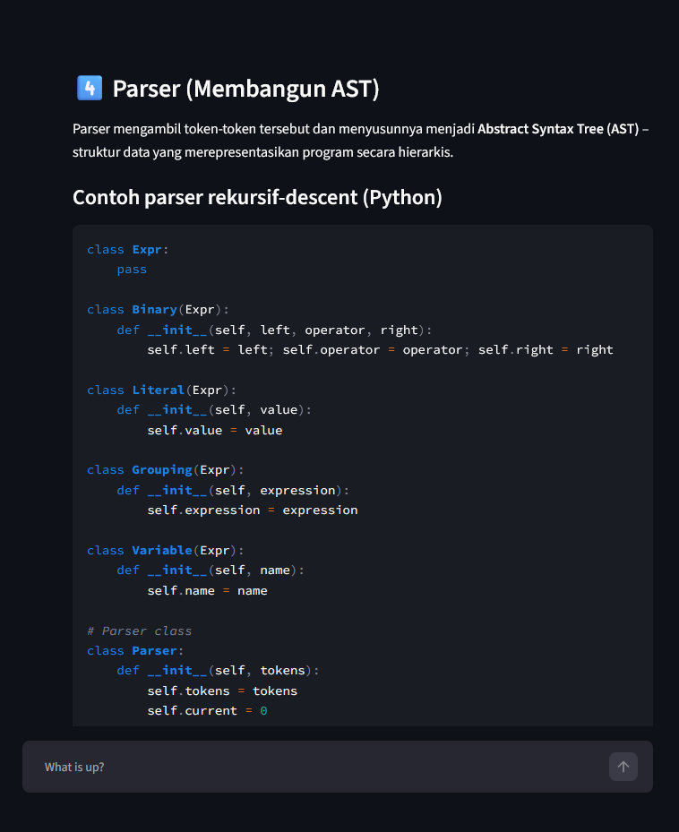
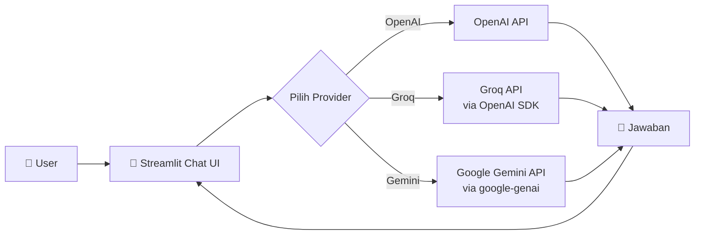

# 💬 Chatbot Multiprovider

> Chatbot berbasis **Streamlit** yang bisa ganti-ganti provider AI dalam satu aplikasi — **OpenAI**, **Groq**, dan **Google Gemini**. Masukkan API key, pilih model, langsung ngobrol. Belum mau install? Coba dulu versi online-nya! 👇

[](https://daffachatbot.streamlit.app/)


## 🚀 Coba Langsung Tanpa Install

Buka versi online-nya di sini: **[daffachatbot.streamlit.app](https://daffachatbot.streamlit.app/)**

- Nggak perlu punya API key — key Groq sudah disiapkan lewat Streamlit secrets
- Versi online ini khusus **Groq** (pilih model dari dropdown, lalu langsung chat)
- Karena memakai kuota API pribadi developer, mohon dipakai secukupnya ya 🙏
- Kalau aplikasinya sedang "tidur" (Streamlit Community Cloud), klik tombol untuk membangunkannya, tunggu sebentar

Suka? Lanjut install di PC kamu sendiri lewat panduan di bawah, dan pakai API key milikmu.

## 🖼️ Preview

**Pilih model Groq, lalu ngobrol — jawaban tampil rapi lengkap dengan tabel & format Markdown:**



**Ramah buat coding — blok kode tampil dengan syntax highlighting:**

<table>
  <tr>
    <td align="center">
      
      <br><sub>Merancang grammar (BNF/EBNF)</sub>
    </td>
    <td align="center">
      
      <br><sub>Contoh parser rekursif-descent (Python)</sub>
    </td>
  </tr>
</table>

> 🎨 Tema mengikuti pengaturan sistem kamu, dan bisa diganti terang/gelap lewat menu **⋮ → Settings → Theme** di pojok kanan atas Streamlit.

## ✨ Fitur Utama

- 🔀 **Multi-provider** — ganti antara OpenAI, Groq, dan Gemini dari satu dropdown
- 🧠 **Banyak pilihan model** — puluhan model siap pilih (Llama, GPT-OSS, Kimi, Qwen, Gemini, Gemma, dll.)
- 🔑 **Bawa API key sendiri** — kolom input berjenis password, dipakai hanya selama sesi browser dan tidak disimpan oleh aplikasi
- 💻 **Cocok buat coding** — blok kode dengan syntax highlighting, plus dukungan Markdown & tabel
- 🇮🇩 **Mendukung Bahasa Indonesia**
- 🪶 **Ringan & simpel** — cuma 4 dependensi, mudah dimodifikasi sesuai kebutuhan

## 🧠 Provider & Model

| Provider | Model yang tersedia | Catatan |
|---|---|---|
| **OpenAI** | `gpt-3.5-turbo` | Jawaban tampil secara *streaming* |
| **Groq** | Llama 3.x / Llama 4, GPT-OSS (`gpt-oss-120b`, `gpt-oss-20b`), Kimi K2, Qwen3, dan lainnya | Base URL bisa diubah; dipanggil lewat OpenAI SDK |
| **Gemini** | Gemini 2.5 Flash, Gemini 2.5 Flash-Lite, Gemma 3 | Dipanggil lewat `google-genai` |

Daftar model lengkap bisa kamu lihat langsung di dropdown aplikasinya.

## 🏗️ Cara Kerja



Groq menyediakan endpoint yang kompatibel dengan OpenAI, jadi cukup pakai OpenAI SDK dengan `base_url` Groq. Gemini dipanggil lewat SDK `google-genai`.

## 📁 Struktur Kode

| File | Fungsi |
|---|---|
| `streamlit_with_groq.py` | ⭐ **Aplikasi utama** — multi-provider (OpenAI, Groq, Gemini), dipakai untuk run di lokal |
| `streamlit_groq_only.py` | Versi khusus Groq untuk di-deploy di Streamlit Community Cloud; membaca API key dari `secrets.toml` (jika tidak ada, user bisa isi manual) |
| `streamlit_app.py` | Template chatbot bawaan Streamlit |
| `requirements.txt` | Daftar dependensi: `streamlit`, `openai`, `requests`, `google-genai` |
| `LICENSE` | Apache License 2.0 |

## ⚙️ Install di Komputer Sendiri

**Prasyarat:** Python 3.10+ (disarankan pakai `miniconda` / `conda` untuk environment).

```bash
# 1. Clone repo
git clone https://github.com/DaffaWiratama/Chatbot-Multiprovider.git
cd Chatbot-Multiprovider

# 2. (Opsional, disarankan) buat environment baru
conda create -n chatbot python=3.11 -y
conda activate chatbot

# 3. Install dependensi
pip install -r requirements.txt

# 4. Jalankan aplikasinya
streamlit run streamlit_with_groq.py
```

Aplikasi akan otomatis terbuka di browser (biasanya di `http://localhost:8501`). Pilih provider, isi API key, lalu mulai chat! 🎉

## 🔑 Dapetin API Key

| Provider | Link |
|---|---|
| OpenAI | [platform.openai.com/account/api-keys](https://platform.openai.com/account/api-keys) |
| Groq | [console.groq.com/keys](https://console.groq.com/keys) |
| Gemini | [aistudio.google.com/app/api-keys](https://aistudio.google.com/app/api-keys) |

## ☁️ Deploy Sendiri ke Streamlit Community Cloud

Mau bikin versi online seperti demo di atas, tanpa user harus isi API key? Pakai `streamlit_groq_only.py`:

1. **Fork** repo ini ke akun GitHub kamu
2. Buka [Streamlit Community Cloud](https://streamlit.io/cloud) → **New app** → pilih repo kamu, dengan *main file* `streamlit_groq_only.py`
3. Di **Advanced settings → Secrets**, tambahkan:
   ```toml
   [groq]
   api_key = "gsk_xxxxxxxxxxxxxxxx"
   base_url = "https://api.groq.com/openai/v1"  # opsional
   ```
4. Klik **Deploy** 🚀

> ⚠️ Kalau mau test secrets di lokal, simpan di `.streamlit/secrets.toml` dan **pastikan file itu tidak ikut ter-commit** ke GitHub.

## 📝 Catatan

- Riwayat chat hanya tersimpan selama sesi browser — hilang saat halaman di-refresh
- Provider OpenAI saat ini memakai model `gpt-3.5-turbo`
- Jawaban dari Groq & Gemini ditampilkan sekaligus, sedangkan OpenAI ditampilkan secara *streaming*
- Versi demo online hanya mendukung Groq

## 📄 Lisensi

Dirilis di bawah [Apache License 2.0](./LICENSE).

## 🙌 Credits

Dibuat oleh [DaffaWiratama](https://github.com/DaffaWiratama), dikembangkan dari template chatbot bawaan Streamlit.

---

Kalau proyek ini berguna buat kamu, jangan lupa kasih ⭐ ya!
